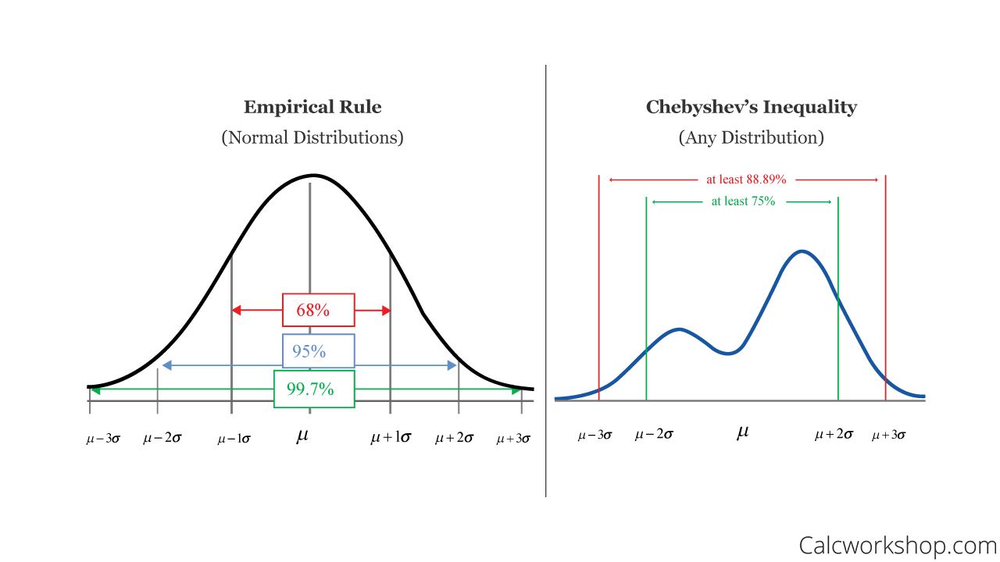
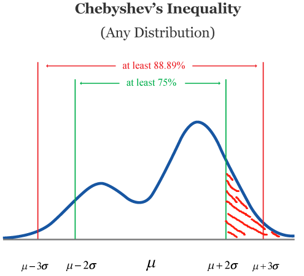
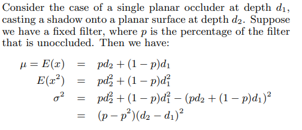
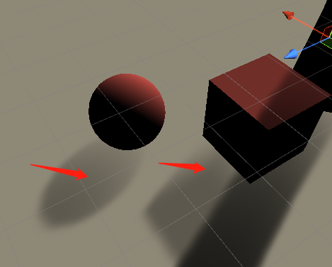
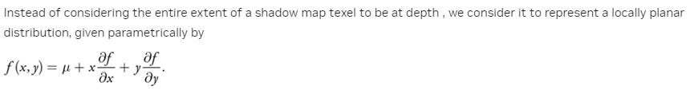
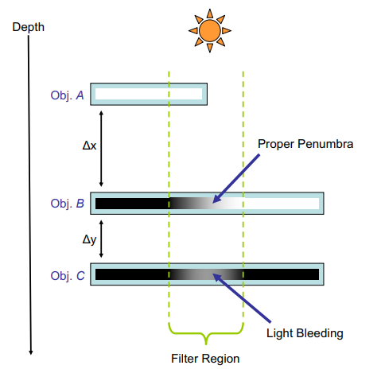
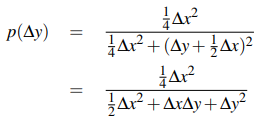
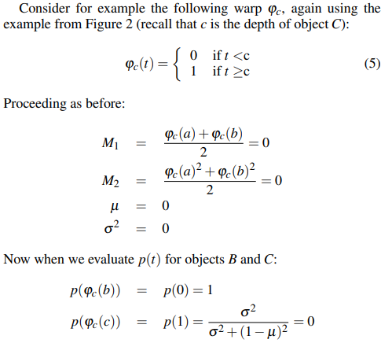

# Variance Shadow Mapping
## Algorithm Overview
### Understand Chebyshev's Inequality
Before going to the implementation, we need to understand the following formulas.

$\mu = E(x)= M_1$

$\sigma^2 = E(x^2) - E(x)^2 = M_2 - M_1$

$P(x \geq t) \leq p_{max}(t) \equiv \frac{\sigma^2}{\sigma^2 + (t - \mu)^2}$

First we should know what $x$ and $t$ represent.
I think $x$ represents the real depth shading point. And $t$ represents the depth of the shading point in the shadowmap.
And then what $p_{max}$ means? Let me explain the [Chebychev’s inequality](https://calcworkshop.com/joint-probability-distribution/chebyshev-inequality/) below because I don't want to just know how to use it but fully understand it.
See this picture(from [calcworkshop.com](https://calcworkshop.com/)).

In normal distribution, there is an empirical rule that we know the probability inside the multiple of standard derivation. As we see in the left picture, the empirical rule tells us about the probability of one standard derivation and two and three.
But what about other distributions? As Calcworkshop.com says, we use Chebyshev’s inequality because it can be to any data set and a wide range of probability distributions, not just normal or bell-shaped curves!
See the right picture above, it is the standard version of the Chebyshev’s inequality so it has two tail probability.
Return to the variance shadow mapping. We think of t as μ + any standard derivation σ. Because t is the actual depth of the light.
So the probability $P(x \geq \mu + 2\sigma)$ is so in this picture(the red region):



So the equation below represents the probability of not being in the shadow with the shading point.

$$P(X \geq t) = p_{max}(t) \equiv \frac{\sigma ^2}{\sigma ^2 + (t - \mu)^2}$$

For t is the depth of the shading point in shadow view. If X is greater than t, it is sure the shading point is not in the shadow.
If we use PCF to determine the probability p of a shading point, we know exactly what the p is.(Because it is calculated by the filter). Then we can use it to calculate the $E(x)$ from paper[2]:



Here comes a question. Why $E(x)$ is computed by the formula above? If we see $E(x)$ as the average depth, maybe we can imagine the equation well.
As the paper[3] mentions, if the depth of the shading point is less than the $E(x)$, it is definitely not in the shadow, otherwise the visibility function is computed by the Chbyshelve equation.

$`
P(x \geq t) \approx\begin{cases}
  1 \space \space \rm if \space t \leq \mu  \\
  \frac{\sigma^2}{\sigma^2 + (t-\mu)^2} \space \space \rm if \space t > \mu
\end{cases}
`$

What if $t >\mu$ or  $t \approx \mu$ ? As I have implemented in my project, we can see the result in the picture below.



This is caused by Chbyshelve's equation which calculates a value close to 1. 
We should give a minimum value of σ² to avoid this problem.
```C++
float variance = max(shadow.g - mean * mean, 0.0002);
float pMax = ChebyshevEquation(z, mean, variance);
return pMax;
```
After modified:


### Biasing
What shadow bias really is? We know that self shadow will cause shadow ance easily. But in variance shadow mapping, we don't need the depth bias since the shadow is not calculated by the depth compare. But we need to clamp the variance to a proper value. So in this case, __Bias__ means variance bias, not depth bias.
From GPU Gem3 chapter 8, a solution to the problem of shadow biasing is introduced. 
If we see the shadow map as a parametric surface, each pixel in shadow map has their tangent plane. As paper[3] says:

I wonder how the formula $f(x,y) = \mu + x \frac{\partial f}{\partial x} + y \frac{\partial f}{\partial y}$ comes. It looks like the __Taylor Expansion__ of the function. But could we approximate $\mu$ as f(0,0)?
So $f(x,y)$ is the depth plane equation for each pixel.Actually, I don't understand how this formula come. If someone knows please tell me.
Then the second moment(the variance) can be computed by the following equation:

$M_2 = E(f^2) = E(\mu^2) + E(x^2)\Big [\frac{\partial f}{\partial x}\Big] ^2 + E(y^2) \Big [\frac{\partial f}{\partial y}\Big] ^2$

If we use half pixel as standard deviation yields

$E(\mu^2) = \mu^2$  

$E(x^2) = E(y^2) = \sigma ^2 \space \space$   

This equation is a mystery to me. Because the distribution area is one pixel?
Therefore

$M_2 = \mu ^2 + \frac{1}{4}\bigg (\Big [\frac{\partial f}{\partial x}\Big] ^2 + \Big [\frac{\partial f}{\partial y}\Big] ^2 \bigg )$

What issue could this calculation resolve? As paper[3] says, it is usually beneficial to clamp the partial derivative portion of $M_2$ to avoid an excessively high variance if an occluder is almost parallel to the light direction.
### Light Bleeding
Let me see how light bleeding is caused. As explained mathematically in paper[2], the visibility function in Object C in the filter region is shown below:



In this case, the depth of object C is $\Delta x + \Delta y + dA $, where dA is the depth of object A. Substain these values into chbyshelve inequality, we get the visibility function value below:



So the visibility in the filter region of object C depends on $\Delta y^2$.
The paper[4] named __Layer Variance Shadow Mapping__ is about one solution to reduce light bleeding. 
The LVSM algorithm needs more shadowmaps to store the layer data, so more memory is needed. I think it is not suitable for mobile games.
But I'd like to say more details about LVSM, for it is important to the generation of __exponential variance shadow mapping__.

## Layered Variance Shadow Maps
### Wrap Function
As we said before, light bleeding situations happen at depth discontinuities in the shadow map. The paper [3] tells us that Chebyshev’s Inequality does depend on the actual depth values, but is guaranteed to provide an upper bound regardless. 
And we know that the upper bound is actually the t, which is the depth of the shading point. What if we change the upper bound by a wrap function?
Paper [3] gives us an example of the wrap function. And this may make object c correct object b no longer correct.



So how to make object b correct again? The author introduces layers. Different layers have different wrap functions. In the case above, if we put object c in layer 1, object b in layer 2, we can get the correct results.
We define a layer has index i, covering an interval [pi, qi], we get the following wrap:

$`\varphi_i(t) = \begin{cases}
  0 \space \space \space \rm if \space t \leq p_{i}  \\
  \frac{t-p_{i}}{q_{i} - p_{i}} \space \space \rm if \space p_{i} < t < q_{i}  \\ 1 \space \space \space \rm if \space q_{i} \leq t
\end{cases}`$

I am not going to state more details about the algorithm because I don't think it is necessary if we choose EVSM.
The remaining details of LVSM are the minimum variance for each layer, the layer overlaps and the Lloyd Relaxation Algorithm which defines the layer ranges.

### Implementation
Here are the summaries of the LVSM implementation.
- Use a four component texture instead of a two component texture to pack two layers.
- If we have more than 2 layers, we use MRTs to output all of the layer data in one pass.
- Store the layers in a texture array.
- While rendering the scene, we determine which layer the current fragment falls into.

### Other Warps
The author introduces another wrap function to reduce light bleeding. The wrap function is the exponential of the depth by the formula below:

$t_{positive}=\rm{exp}(c_x * t)$

$t_{negative}=-\rm{exp}(-c_y * t)$

As the LVSM algorithm mentions, we use the wrap function values to calculate Chebyshev.

### EVSM Implementation
If you use the half precision floating point as the shadowmap channel, the max floating value is 65504. But the exponential function can be much larger than 65504, so we must limit the constant exponentials to 5. And the shadow map clear color must be set as (65504.0f, 65504.0f, 0, 0) because it can't exceed the max upper bound.
```c++
if (shadowType == ShadowType.VSM || shadowType == ShadowType.EVSM)
{
    return new TextureDesc(m_ShadowmapWidth, m_ShadowmapHeight)
    {
        filterMode = m_FilterMode,
        depthBufferBits = DepthBits.None,
        name = m_Name,
        wrapMode = TextureWrapMode.Clamp,
        colorFormat = ShadowSettings.GetShadowmapFormat(shadowType),
        clearColor = shadowType == ShadowType.VSM ? Color.white : new Color(65504.0f, 65504.0f, 0, 0),
        autoGenerateMips = false,
        useMipMap = false,
        clearBuffer = true
    };
}
```
Because it is only 2 layers, light bleeding still exists. One way to reduce light bleeding is we can remap the upper bound to a small range. This means that if the pMax is large, it will be remapped to a small value.
//remap the shadow pMax: https://therealmjp.github.io/posts/shadow-sample-update/
```c++
float Linstep(float a, float b, float v)
{
    return saturate((v - a) / (b - a));
}

// Reduces VSM light bleedning
float ReduceLightBleeding(float pMax, float amount)
{
    // Remove the [0, amount] tail and linearly rescale (amount, 1].
    return Linstep(amount, 1.0f, pMax);
}
```
Assigning a value amount, all the p less than this value will be set to zero, and the values larger than it will be remapped to [0, 1].

## Reference
- https://calcworkshop.com/joint-probability-distribution/chebyshev-inequality/ [1]

- http://igm.univ-mlv.fr/~biri/Enseignement/MII2/Donnees/variance_shadow_maps.pdf [2]

- https://developer.nvidia.com/gpugems/gpugems3/part-ii-light-and-shadows/chapter-8-summed-area-variance-shadow-maps [3]

- [Layered Variance Shadow Maps](https://dl.acm.org/doi/pdf/10.5555/1375714.1375739) [4]
